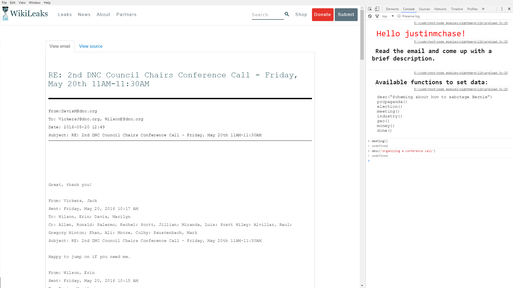

# DNCLeak DataEntry

This is a real quick app to help facilitate the gathering of DNC Leak DataEntry

## Install

* [git](https://git-scm.com/)
* [node.js](https://nodejs.org)

## Run

Use git bash to run all commands even on windows.

```
$ git clone git@github.com:justinmchase/dncleak-dataentry.git
$ cd dncleak-dataentry
$ npm install
```

Next, open up `urls.txt` in this folder and paste a set of urls from [the google doc](https://docs.google.com/spreadsheets/d/1ORUwiu-JsJ15xqgIGeP-P14WJULt9B5fZRNzQaPDxjk/edit#gid=0). Now run the app.

```
$ node .
What is your reddit username?
```

Enter your username and then follow the instrutions in the following browser window to enter data about the email.

## Uploading The Data

Once you have gathered data for all of the urls, the data will be copied into a file called `data.xls`. Open that file and copy + paste into the google doc.

Next grab more urls and repeat!


